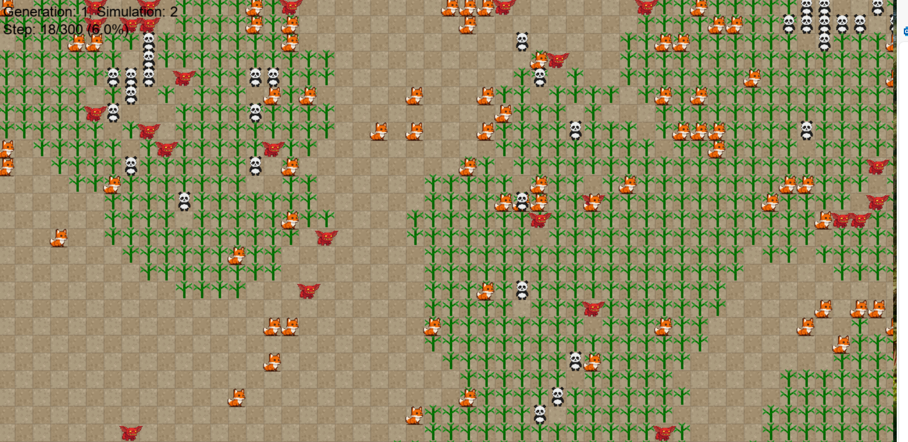

# evolution_sim

# Evolution Simulation

A Python-based evolution simulation where animals compete for survival in a virtual ecosystem and adapt there genes according to their environment. The simulation features:
- Herbivores, carnivores and omnivores with different behaviours
- Plant resources that grow and regenerate
- Movement and hunting logic for different species represented by genes
- Visual representation of the ecosystem

## How the Genes work and are passed on to the offspring

A gene is description of how to react if you:
- See the closest carnivore in a distance for e.g. 4
- The closest plant in a distance of e.g. 3
- The closest omnivore at a distance of e.g. 2
- No herbivore in the vision radius

These genes can be controlled in the congif.py

With a vision radius of 4 an animal has therefore 5*5*5 genes

The reaction for a gen are chosen randomly when we start the simulation – actions are:
Move_random, flee_from_certain_animal_type, move_towards_certain_animal_type, standing still, move_towards_grass

If animals are standing close to each other, they can produce offspring

The gens of the child contain 50% of the gens from the "mother" and 50% from the "father"
There is a 25% chance that a random mutation occurs altering up to 10% of the gens
After reproducing a mating "cool down" is activated
After a simulation the fittest gens of the last generation are used to generate the next gen pool

## Technical Stack

### Core Simulation built with Python
- Animal behavior and logic
- Plant growth systems
- Evolution mechanics
- Ecosystem rules

### Graphics/Visualization Options

Built with **Pygame*

## Installation

1. Clone the repository
2. Install dependencies with `pip install -r requirements.txt`
3. Run the simulation with `python main.py`

   

